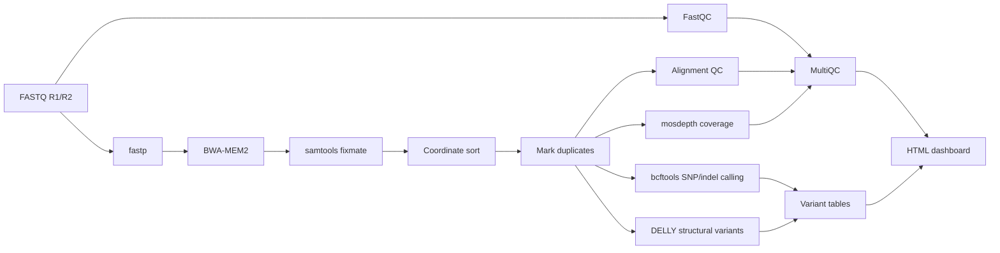
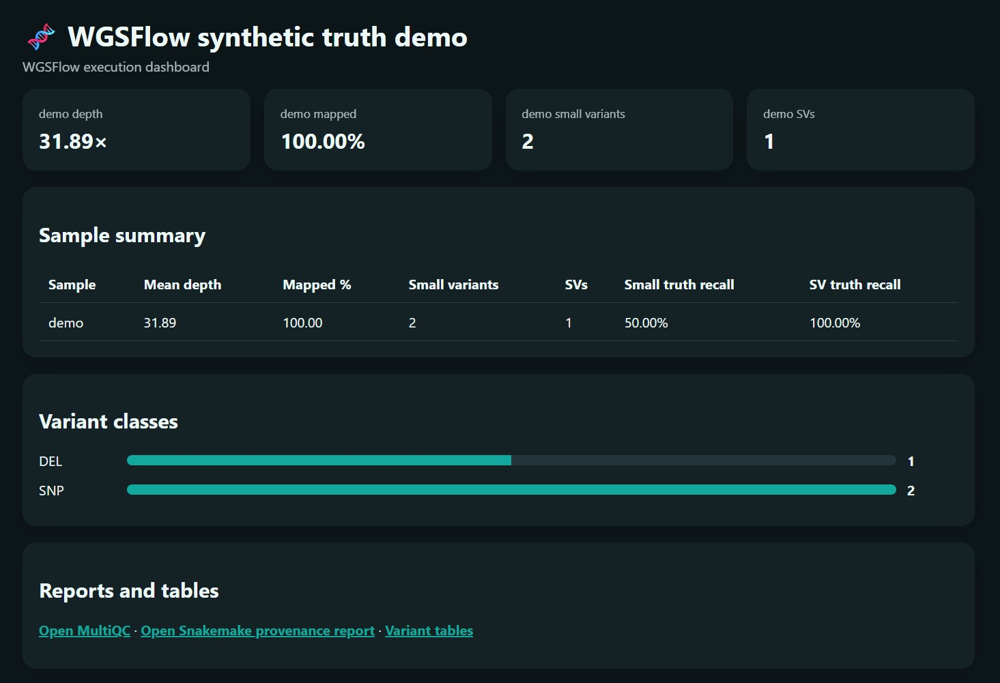

<div align="center">

# WGSFlow v0.3.2 🧬

### Reliable paired-end WGS/WES analysis from FASTQ to variants

[](https://snakemake.github.io/)
[](https://www.python.org/)
[](https://pixi.sh/)
[](https://github.com/bwa-mem2/bwa-mem2)
[](https://www.htslib.org/)
[](https://samtools.github.io/bcftools/)
[](https://github.com/dellytools/delly)
[](https://multiqc.info/)
[](LICENSE)

**A deliberately dependable Snakemake workflow for paired-end short-read germline Whole Genome Sequencing (WGS) and Whole Exome Sequencing (WES).**

WGSFlow prioritizes **successful execution, transparent logs, reproducibility, and useful downstream outputs** over fragile experimental integrations.

</div>

---

## Workflow



```text
FASTQ R1/R2
  ├─ FastQC
  └─ fastp
       └─ BWA-MEM2
            └─ samtools fixmate → coordinate sort → markdup
                 ├─ samtools flagstat/stats
                 ├─ mosdepth coverage
                 ├─ bcftools SNP/indel calling
                 └─ DELLY structural-variant calling
                       ├─ MultiQC
                       ├─ TSV variant tables
                       ├─ HTML dashboard
                       └─ standard Snakemake HTML report
```

## Highlights

* Reproducible environment management with **Pixi**
* Workflow orchestration with **Snakemake 9**
* Read QC and filtering with **FastQC** and **fastp**
* Fast alignment with **BWA-MEM2**
* BAM sorting, duplicate removal and indexing with **samtools**
* Genome-wide coverage summaries with **mosdepth**
* SNP and small-indel calling with **bcftools**
* Structural-variant calling with **DELLY**
* Aggregated QC reporting with **MultiQC**
* Human-readable TSV variant tables
* Standalone HTML analysis dashboard
* Rule-specific and controller-level logs
* Automatic full-DAG preflight before execution
* Optional completion email outside Snakemake
* Deterministic synthetic truth dataset
* Small public real-data integration test

## MVP boundaries

The current release intentionally avoids integrations that increase complexity before the core workflow has been validated across diverse datasets.

Not currently included:

* custom Snakemake logger plugins
* `onstart`, `onsuccess`, or `onerror` hooks
* executor, storage, or report plugins
* DeepVariant containers
* VEP, hap.py, or Truvari
* FastAPI, JBrowse, Plotly, or Polars
* per-rule Conda environments
* SLURM or cloud profiles

These remain valuable future additions, but none should block a reliable FASTQ-to-variants run.

## Installation

Linux or WSL2 is required.

Install Pixi:

```bash
curl -fsSL https://pixi.sh/install.sh | bash
```

Restart the terminal after installation, then clone WGSFlow:

```bash
git clone https://github.com/pyareedash/wgsflow.git
cd wgsflow
```

Install the environment and local CLI:

```bash
pixi install
pixi run install
```

Verify the installation:

```bash
pixi run wgsflow --help
```

### Installation notes

The first `pixi install` may take several minutes because it downloads the complete bioinformatics environment.

Pixi may display a warning about a skipped `librsvg` post-link script. This does not affect the workflow or generated reports.

Run commands through `pixi run` so that Snakemake and all genomics tools come from the reproducible project environment:

```bash
pixi run wgsflow ...
```

Avoid manually installing packages inside `.pixi/envs/default`. Add new dependencies to `pixi.toml` instead.

## WSL recommendation

WGSFlow works under WSL2, but BAM sorting, indexing, and workflow execution involve substantial filesystem activity.

For better performance, keep the repository and analysis files inside the WSL Linux filesystem:

```bash
mkdir -p ~/projects
cd ~/projects

git clone https://github.com/pyareedash/wgsflow.git
cd wgsflow
```

Running under a Windows-mounted directory such as:

```text
/mnt/c/projects/wgsflow
```

also works, but I/O-heavy steps may be noticeably slower.

## Run the synthetic truth dataset

Generate the deterministic paired-end test dataset:

```bash
pixi run wgsflow data synthetic --force
```

Confirm that the environment, executables, configuration, and inputs are valid:

```bash
pixi run wgsflow doctor --config config/demo.yaml
pixi run wgsflow validate --config config/demo.yaml
```

Preview the complete DAG without executing tools:

```bash
pixi run wgsflow dry-run \
  --config config/demo.yaml \
  --cores 4
```

Run the workflow:

```bash
pixi run wgsflow run \
  --config config/demo.yaml \
  --cores 4
```

The synthetic sample contains:

* one homozygous SNP
* one 3 bp deletion
* one 1 kb structural deletion

The generated dashboard compares emitted calls with the included truth VCFs.

## Dashboard and reports

Open the finished dashboard:

```bash
pixi run wgsflow serve \
  --config config/demo.yaml \
  --open
```



The dashboard summarizes:

* mapping and alignment quality
* genome coverage
* small-variant counts
* structural-variant counts
* variant quality distributions
* planted truth events
* paths to detailed outputs

MultiQC is also included as the detailed third-party quality-control report for read processing, alignment, coverage, and variant-calling metrics.

## Expected outputs

```text
results/demo/
├── alignment/
│   ├── demo.markdup.bam
│   └── demo.markdup.bam.bai
├── variants/
│   ├── demo.small.vcf.gz
│   ├── demo.small.vcf.gz.tbi
│   ├── demo.sv.vcf.gz
│   └── demo.sv.vcf.gz.tbi
├── tables/
│   ├── demo.small.tsv
│   └── demo.sv.tsv
├── qc/
│   ├── fastqc/
│   ├── fastp/
│   ├── alignment/
│   ├── coverage/
│   └── multiqc/
└── report/
    ├── summary.json
    ├── summary.tsv
    ├── dashboard.html
    └── snakemake-report.html
```

| Output                  | Description                              |
| ----------------------- | ---------------------------------------- |
| `dashboard.html`        | Compact analysis and variant summary     |
| `multiqc_report.html`   | Aggregated quality-control report        |
| `snakemake-report.html` | Workflow execution and provenance report |
| `*.small.vcf.gz`        | SNP and small-indel calls                |
| `*.sv.vcf.gz`           | Structural-variant calls                 |
| `*.small.tsv`           | Human-readable small-variant table       |
| `*.sv.tsv`              | Human-readable structural-variant table  |

Generated FASTQs, references, BAMs, VCFs, results, logs, Pixi environments, and Snakemake state are excluded from Git.

## Run a small real human dataset

The optional quick-start command downloads Google’s public NA12878 chromosome 20 DeepVariant tutorial bundle, converts the coordinate-sorted BAM back into paired FASTQs, and stores it under `resources/quickstart/`.

```bash
pixi run wgsflow data quickstart --force

pixi run wgsflow run \
  --config config/quickstart.yaml \
  --cores 4
```

This is a compact real-data integration test. It is useful for evaluating alignment and SNP/indel behavior but is too small to assess structural-variant sensitivity properly.

For more serious benchmarking, progress to GIAB HG002 chromosome 20 and eventually full HG002. See [`docs/datasets.md`](docs/datasets.md).

## Use your own data

Create a tab-separated sample sheet:

```tsv
sample	read1	read2
patient01	data/patient01_R1.fastq.gz	data/patient01_R2.fastq.gz
```

Copy the demonstration configuration:

```bash
cp config/demo.yaml config/my-study.yaml
```

Update:

* the project name
* sample-sheet path
* reference FASTA
* output directory
* filtering parameters

Disable bundled truth data:

```yaml
truth:
  small_vcf: null
  sv_vcf: null
```

Use a dedicated output directory:

```yaml
output_dir: results/my-study
```

Validate before execution:

```bash
pixi run wgsflow validate \
  --config config/my-study.yaml

pixi run wgsflow dry-run \
  --config config/my-study.yaml \
  --cores 8

pixi run wgsflow run \
  --config config/my-study.yaml \
  --cores 8
```

Input FASTQs and reference files should remain outside the configured output directory.

## Logging and failure recovery

WGSFlow uses Snakemake’s supported console logging directly.

* Each rule writes a dedicated log under `logs/<project>/`.
* Complete controller output is copied to a timestamped file under `logs/runs/`.
* Every real run performs an automatic full-DAG dry-run before starting native tools.
* Workflow validation rejects unsupported shell placeholders before execution.
* `--show-failed-logs`, `--printshellcmds`, and `--rerun-incomplete` are enabled.
* Report or email failures do not replace the scientific workflow exit status.

After correcting a failed step, rerun the same command. Snakemake will preserve valid completed outputs and continue from failed or incomplete rules.

## Optional completion email

Email is sent by the outer Python command after Snakemake exits. It is not implemented as a Snakemake plugin or lifecycle hook.

Enable email in the project configuration and export SMTP credentials:

```bash
export WGSFLOW_SMTP_HOST=smtp.example.org
export WGSFLOW_SMTP_PORT=587
export WGSFLOW_SMTP_USER=your-user
export WGSFLOW_SMTP_PASSWORD='your-password'
export WGSFLOW_EMAIL_FROM=wgsflow@example.org
```

If SMTP delivery fails, the workflow result remains unchanged and the notification failure is emitted only as a warning.

## CLI design

Typer is used only at the user-facing boundary.

```text
Typer command
      ↓
validated request
      ↓
plain Python service
      ↓
Snakemake
```

The scientific and workflow logic remains in ordinary Python functions, making it reusable from tests, notebooks, or future interfaces.

## Development

Run the test suite:

```bash
pixi run test
```

Run formatting and lint checks:

```bash
pixi run lint
```

Validate the demonstration DAG:

```bash
pixi run wgsflow dry-run \
  --config config/demo.yaml \
  --cores 2
```

## Scope

WGSFlow currently targets paired-end short-read germline WGS and WES.

It is intended for:

* reproducible research
* workflow development
* portfolio demonstrations
* public-data analysis
* small research projects
* progressive testing against GIAB datasets

WGSFlow is not clinically validated. Human genomic data must be processed according to applicable consent, privacy, security, and institutional requirements.

## Roadmap

Future additions will be introduced individually with dedicated integration tests:

* DeepVariant as an optional caller
* VEP annotation
* hap.py and Truvari benchmarking
* GIAB benchmark profiles
* SLURM execution
* containerized releases
* richer genome-browser integration
* cohort-aware processing

## Acknowledgements

WGSFlow builds on excellent open-source tools developed by the Snakemake, HTSlib, BWA-MEM2, fastp, mosdepth, MultiQC, and DELLY communities.

## License

Released under the [MIT License](LICENSE).

---

<div align="center">

**Built for reproducible genomics 🧬**

</div>
